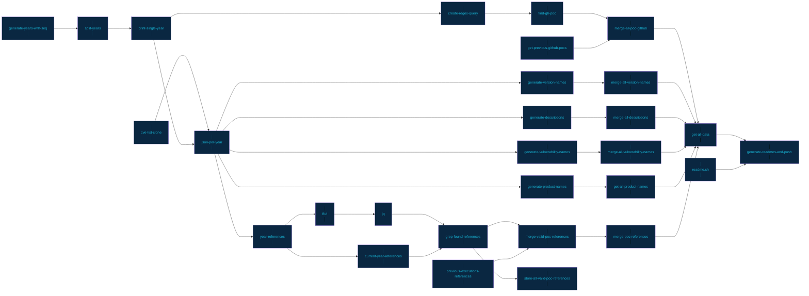

<h1 align="center">CVE PoC <a href="https://twitter.com/intent/tweet?text=CVE%20PoC%20-%20Find%20almost%20every%20publicly%20available%20CVE%20Proof-of-Concept%2E%0Ahttps%3A%2F%2Fgithub%2Ecom%2Ftrickest%2Fcve%0A&hashtags=cve,poc,vulnerability,vulnerabilities,exploit,infosec,cybersecurity"></a></h1>
<h3 align="center">Almost every publicly available CVE PoC.</h3>


## How it works
### [Trickest](https://trickest.com) Workflow Architecture



### TB; DZ (Too big; didn't zoom):
- Collect CVE details from [cvelist](https://github.com/CVEProject/cvelist) (Shout out to [CVE Project](https://github.com/CVEProject)!)
- Split CVEs up by year.
- Find PoCs for each CVE using 2 techniques:
    1. References
        - Gather each CVE's `References`.
        - Check if any of them points to a PoC using [ffuf](https://github.com/ffuf/ffuf) and a list of keywords

         Regex:
         ```(?i)[^a-z0-9]+(poc|proof of concept|proof[-_]of[-_]concept)[^a-z0-9]+```

         (Thanks [@joohoi](https://github.com/joohoi)!)
         
         **Note**: [ffuf](https://github.com/ffuf/ffuf) is awesome for more purposes than just content discovery.
    2. Github
        
        Search GitHub for repositories with [find-gh-poc](https://github.com/trickest/find-gh-poc) (release soon!) that mention the CVE ID.
- Get manually added CVEs with their PoCs.
- Get all previous results and deduplicate.
- ```grep -v``` bad results by using ```blacklist.txt```
- Merge all of the found PoCs.
- Generate GitHub badges for each affected software version using [shields.io](https://shields.io).
- Write everything into easy-to-read markdown files.


> **As described, almost everything in this repository is generated automatically. We carefully designed the workflow (and continue to develop it) to ensure the results are as accurate as possible.**


## Use cases 
- Browse around, find a nice PoC, and test away!
- `Watch` the repository to receive notifications about new PoCs as soon as they go public.
- Search for a specific product(s) (and possibly version) to find all public exploits related to it.
- Monitor the [atom feed](https://github.com/trickest/cve/commits/main.atom) for a specific product(s).

## Contribution
All contribtutions/ideas/suggestions are welcome! Create a new ticket via [GitHub issues](https://github.com/trickest/cve/issues) or tweet at us [@trick3st](https://twitter.com/trick3st).

## Build your own workflows

We believe in the value of tinkering; cookie-cutter solutions rarely cut it. Sign up for a demo on [trickest.com](https://trickest.com) to customize this workflow to your use case, get access to many more workflows, or build your own from scratch!
